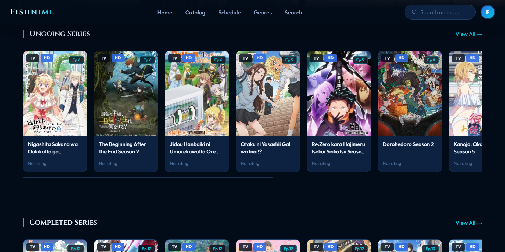

# fishnime
Fishnime Streaming Anime Online
FISHNIME

FISHNIME is a modern anime streaming web application built using Next.js 14, React 18, and TypeScript with a focus on performance, scalability, and user experience. The application features a clean UI design with a deep navy and cyan theme.

The platform is powered by the Sankanime REST API, enabling dynamic data fetching for anime content, including ongoing updates, episode streaming, and detailed information pages.

This project focuses on building a fully interactive frontend application with advanced state management, real-time search functionality, and seamless user navigation.

## Live Demo
[S2U Fansite Website](https://fishnime.vercel.app/)

## Preview

Key Features:

Home page with auto-rotating hero and categorized anime sections (Recent, Ongoing, Popular, Completed)
Advanced search with debounced real-time results and genre filtering
Anime catalog with multiple filter options
Weekly airing schedule with current day highlighting
Detailed anime pages with metadata, ratings, and episode lists
Episode streaming with multi-server frame player and navigation controls
User authentication (localStorage-based) for login and registration
Personal watchlist system (Watching, To Watch, Watched)

Key Contributions:

Built a scalable frontend architecture using Next.js App Router
Integrated external REST API for dynamic content rendering
Implemented responsive UI and optimized user experience
Developed reusable components and structured state management

Tech Stack: Next.js 14, React 18, TypeScript, Tailwind CSS, REST API

Skills: TypeScript, JavaScript, +4 skills
